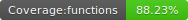

## sql objects detector

Simple scan to detect all the common sql objects like tables & procedures. Useful for legacy discovery

   

```
export FOLDER_ABSOLUTE_LOCATION_TO_SCAN="/foo/bar/awful/legacy-web"
npm run scan
```

You will see a folder in which the static html is created: 

```
static dashboard : /foo/sql-tables-detector/.export/f35a6945-3d3e-444b-ae2c-e89b7a939cc9 
```

If you open it on a static server you should see something like this

